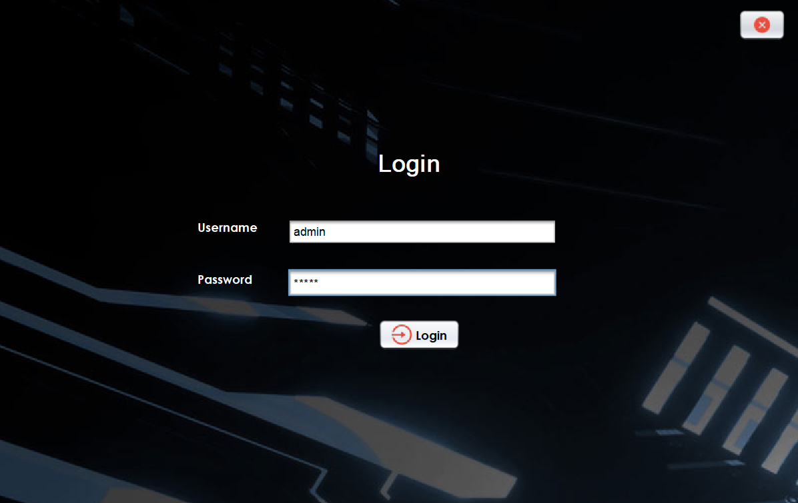

# 💊 PharmEase

**PharmEase** is a Java-based pharmacy management system developed during my third semester. The project applies Object-Oriented Programming (OOP) principles, utilizes **Java Swing** for the graphical user interface (GUI), and integrates **MySQL** for efficient database management.

## 📜 Project Overview

PharmEase provides a user-friendly and efficient way to manage pharmacy operations, including inventory management, pharmacist administration, sales tracking, and customer management.

## ⚙️ Features

- **User-Friendly Interface**: The application leverages **Java Swing** to provide an intuitive, easy-to-navigate graphical user interface (GUI).
  
- **Database Integration**: MySQL is used for effective storage and management of all pharmacy-related data, ensuring smooth and reliable data processing.
  
- **OOP Concepts**: The system showcases core OOP concepts such as encapsulation, inheritance, polymorphism, and abstraction, making the code maintainable and scalable.

- **Comprehensive Functionality**: PharmEase allows users to perform a variety of tasks related to pharmacy management, such as:
  - Admin features including user management, dashboards, and application control.
  - Pharmacist features for inventory management, sales processing, and billing.

## 🖼️ Snapshots

### Admin Features

- **Login**
  

- **Dashboard**
  

- **Add User**
  

- **Profile**
    

- **View User**
  

- **Update User**
  

- **Logout**
  

- **Close Application**
  

### Pharmacist Features

- **Dashboard**
  
  
- **Add Medicine**
  

- **Sell Medicine**
  

- **View Medicine**
  

- **Update Medicine**
  

- **View Bill**
  

- **PDF of the Bill**
  

## 🛠️ Technologies Used

- **Java**: The core language used for development.
- **Java Swing**: Used for building the graphical user interface (GUI).
- **MySQL**: Used as the database for storing and managing pharmacy data.

## 📅 Conclusion

PharmEase is a comprehensive pharmacy management solution that effectively addresses the complexities of pharmacy operations. By integrating user-friendly features with robust database management and the principles of Object-Oriented Programming, this application provides a scalable and efficient way to manage pharmacy tasks. Whether you are an administrator or a pharmacist, PharmEase offers the tools necessary to streamline your workflow and enhance productivity in the pharmacy setting.

---

Feel free to modify any sections or add more details as needed! Let me know if you need any further adjustments.
